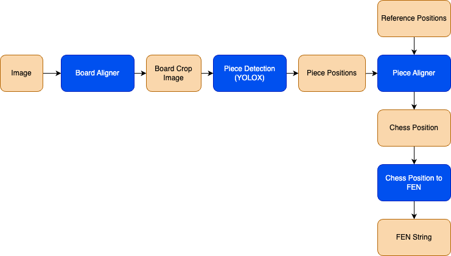

# ChessAI - Chinese Chess Game Analyzer

ChessAI is a groundbreaking tool that brings together computer vision, chess algorithms, and advanced analytics to revolutionize the Chinese Chess analytics landscape. With ChessAI, you don't need expensive electronic boards to analyze your games. Simply use your regular board, set up a camera to capture the position, and let ChessAI do the rest.

- Main source code: `chesssai`.
- Deep Learning / Data Preparation: `dnn_models/data_preparation` - Currenly only support for Chinese Chess (XiangQi), [contact me](https://aicurious.io/contact) for the license and the source code of the data preparation tool.
- Deep Learning / Training: `dnn_models/training`.

## Roadmap

- [x] Chess position detection.
- [x] Chess engine integration.
- [ ] Move recognition.
- [ ] Move history.
- [ ] Move suggestion.
- [ ] Play against the computer.
- [ ] Game analysis with engine.
- [ ] Game analysis with ChatGPT + Voice.
- [ ] Play against other players.
- [ ] Camera calibration.
- [ ] Deep learning model for chess board detection (No need to use ARUCO markers).
- [ ] Support for other chess variants.

## Environment setup

- Requirements: Python 3.9, [Conda](https://docs.conda.io/en/latest/miniconda.html), Node.js 18+.
- Clone this repository.

```bash
git clone https://github.com/vietanhdev/chessai --recursive
```

- Create a new conda environment and the required packages.

```bash
conda create -n chessai python=3.9
conda activate chessai
pip install -e .
```

- Install Node.js packages and build the frontend.

```bash
cd chessai/frontend
npm install
cd ..
bash build_frontend.sh
```

## Build chess engine

- This project uses [godogpaw](https://github.com/hmgle/godogpaw) as the chess engine.
- Install [Go](https://go.dev/doc/install).
- Build the engine.

```bash
cd godogpaw
go build
```

- Copy the executable file (`godogpaw*`) to the [./data/engines](./data/engines) folder.

## Run the app

```bash
ENGINE_PATH="data/engines/godogpaw-macos-arm" python -m chessai.app --run_app
```

Replace `ENGINE_PATH` with the path to the chess engine executable file.

## Data preparation & Training

This project uses computer vision and deep learning to detect chess pieces and chess board position.

**AI flow for chess position detection:**



- Go to [dnn_models](./dnn_models) folder and follow the instructions in the `README.md` file to prepare the data and train the model.
- **NOTE:** Only training source code and pretrained models are included in this repository. The data preparation scripts and the training datset are not included. [Contact me](https://aicurious.io/contact) for the license and the data.

## References

- This project was initially built for [Hackster's OpenCV AI Competition 2023](https://www.hackster.io/contests/opencv-ai-competition-2023). Hackster Project: [ChessAI - Chinese Chess Game Analyzer](https://www.hackster.io/vietanhdev/chessai-chinese-chess-game-analyzer-4be768).
- Object detection model (for chess pieces) is based on [YOLOX](https://github.com/Megvii-BaseDetection/YOLOX) - License: Apache 2.0.
- Chess engine: [godogpaw](https://github.com/hmgle/godogpaw) - License: MIT.
- UI components: [shadcn-ui](https://github.com/shadcn-ui/ui) - License: MIT.
